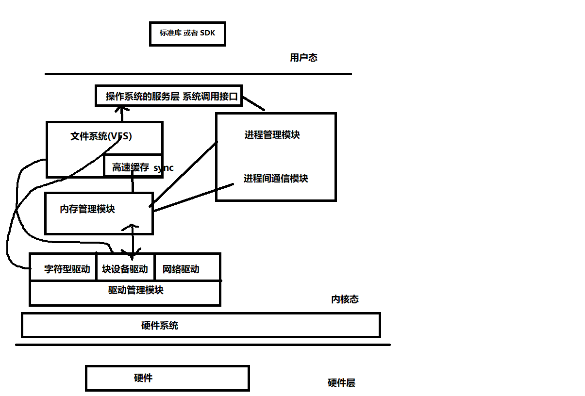

# Linux内核体系结构

## 内核模式与体系结构

**操作系统的结构**

* 用户应用程序

* 操作系统的服务层 `sys_call` 快递

* 操作系统内核 （文件系统 内存管理 进程管理 驱动管理）

* 硬件系统：驱动

**操作系统的工作方式：**

* 1.把操作系统从用户态 切换到内核态 （用户应用程序 到内核的流程）
* 2.实现操作系统的系统调用 （操作系统服务层）
* 3.应用操作系统提供的底层函数，进行功能实现
  * 3.1 操作系统的驱动结构
* 4.退出后从内核态切换到用户态

**操作系统内核中各级模块的相互关联**

* Linux内核的整体模块：进程调度模块、内存管理模块、文件系统模块、进程间通信模块、驱动管理模块
* 每个模块间的关系
  * 内存管理和驱动管理模块  虚拟内存的缓存和回存机制
  * `VFS` 虚拟文件系统 把硬件当成文件来进行使用

**操作系统结构的独立性**

* 管理层 （管理和实现独立开）
* 实现层

易于升级和维护  1991-2016

高版本的内核

低版本的内核    之间的驱动

多的是内核驱动的种类  内核驱动的管理模式并没有巨大的改变（一段时间3个阶段的条约 零散型 分层型  设备树）

进程的调度算法发生了改变   进程的管理方式并没有巨大的改变

